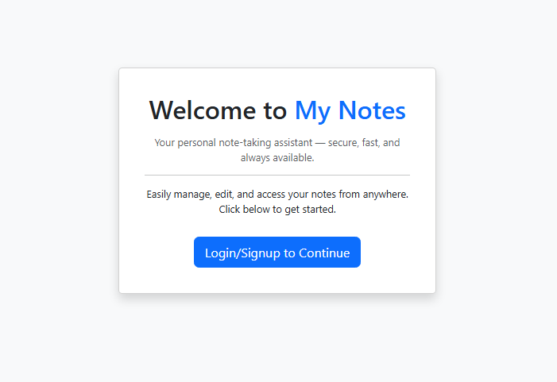
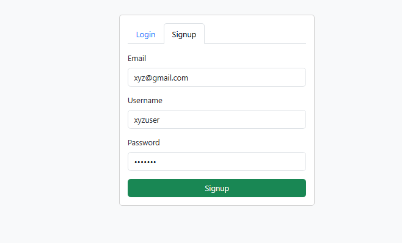
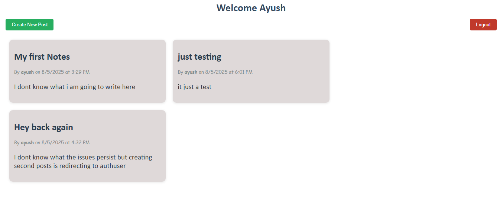

# 📝 Supabase Notes App

A full-stack Notes application built with **Node.js**, **Express**, **Supabase**, and **EJS**. Authenticated users can sign up, log in, create and view personal notes, and delete them securely.




---

Watch, create, and keep your own personal notes — enjoy using myNote at:
🔗 https://personal-notes-xi.vercel.app/


---

## 🚀 Features

- User authentication using Passport.js with **email/password login**
- Secure password hashing via **bcrypt**
- Session-based login system
- Create, view, and delete personal notes
- Clean and responsive **EJS** frontend
- Styled for both **desktop and mobile** using custom CSS
- Backend powered by **Supabase (PostgreSQL)**

---

## 🧠 Tech Stack

| Layer       | Technology                |
|------------|---------------------------|
| Frontend   | EJS, HTML, CSS            |
| Backend    | Node.js, Express.js       |
| Database   | Supabase (PostgreSQL)     |
| Auth       | Passport.js (local strategy), bcrypt |
| Deployment | ( Vercel) |

---

## 🛠️ Setup & Installation

1. **Clone the repo**
   ```bash
   https://github.com/ayushverma2909/Personal-Notes.git
   cd supabase-notes-app
   npm i
